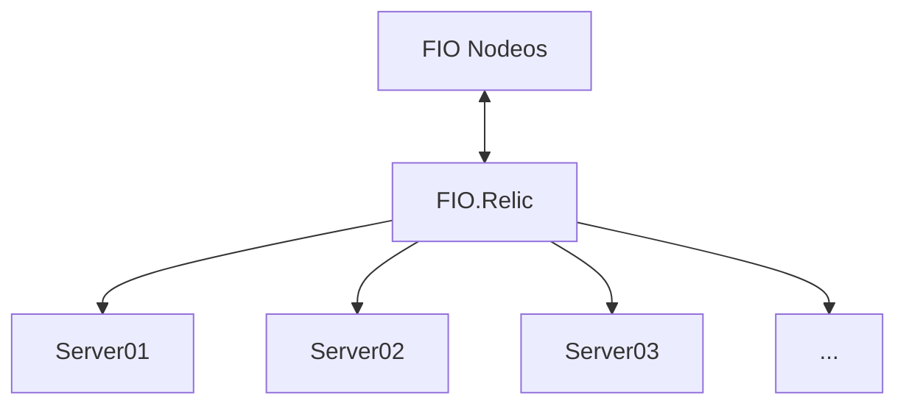
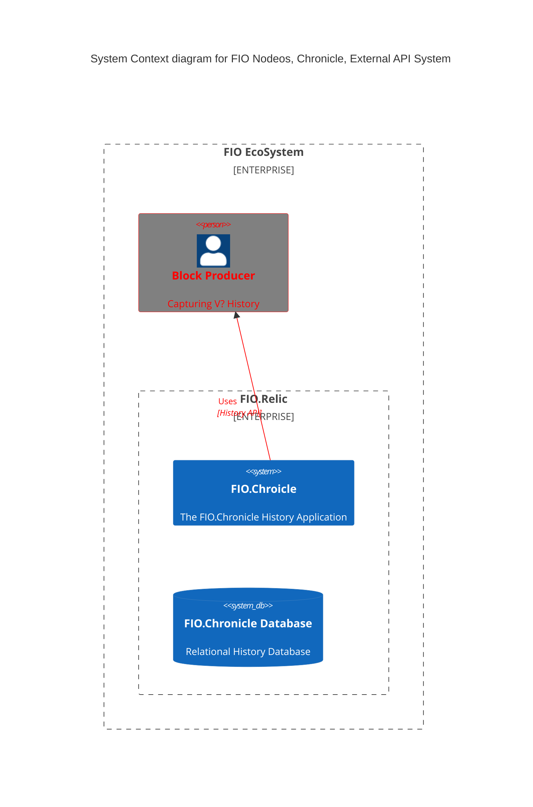
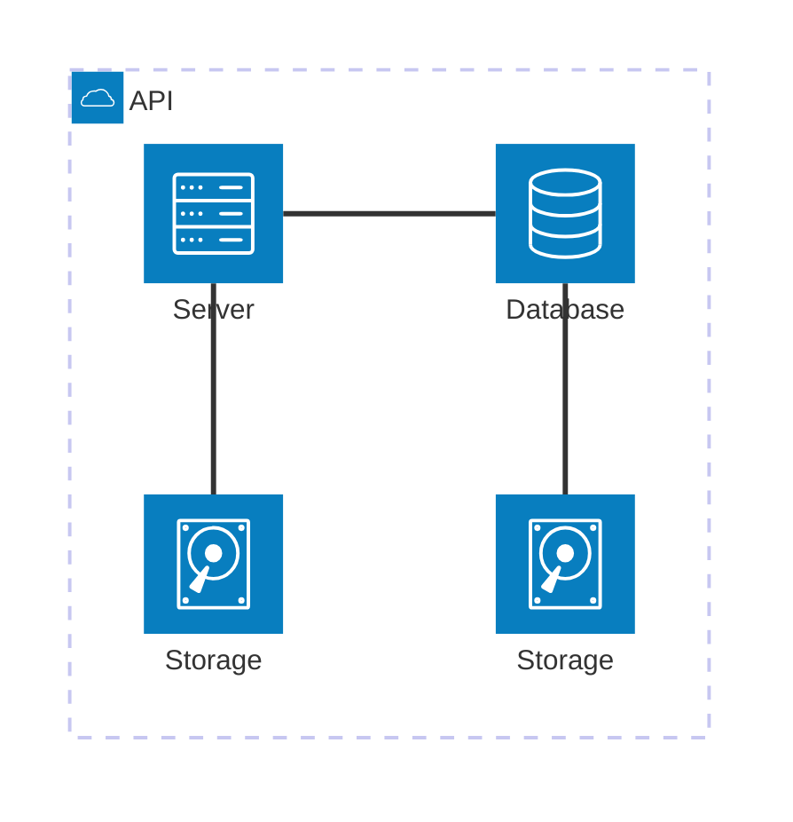
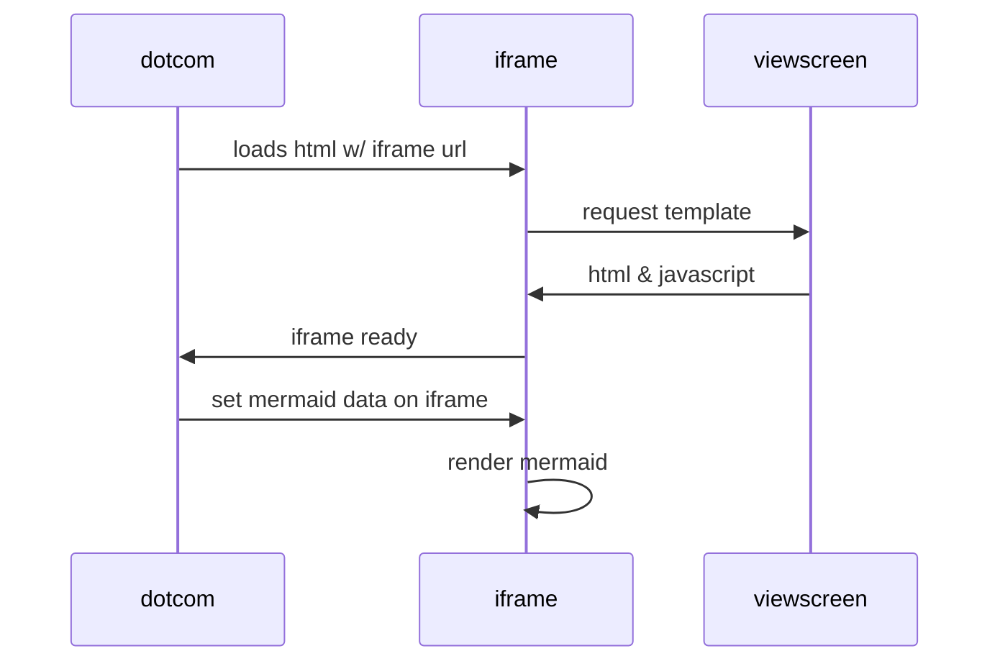

# FIO.Relic Tech Stack

### The What
The FIO.Relic tech stack is the set of technologies used to develop and/or deploy the application, including the programming languages, frameworks, databases, front-end and back-end tools, and APIs. As the FIO Development Envirionment is standalone, it will have a slightly different deployment then a typical production envirionment.

#### Server Spec
* Hardware:
  * ubuntu-focal-20.04-amd64-server
  * Storage: 120GB minimum
  * Physical CPU: >= 2
  * Virtual CPU: >= 4
  * Architecture: x86_64
  * Memory: >= 8GB
  * Clock Speed: 2.2 GHz

* OS: Ubuntu 20.04

* Software
  * Programming Language: C++
  * Bash/Python
 
* Database
  * PostgreSQL 16

## Simple Production API Interaction

## FIO System Architecture

### OLD
### Example Architecture Diagram; to aid in creation of a tech stack diagram

Front End Framework
   Client Side

