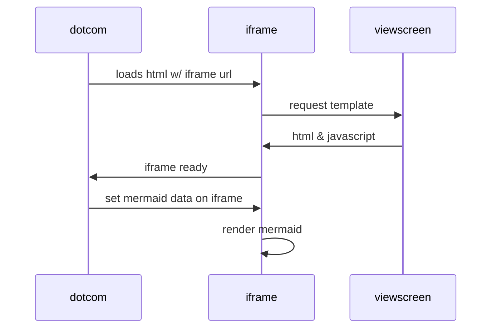

# FIO.Relic Tech Stack

### WHAT IS
A tech stack is the set of technologies used to develop an application, including programming languages, frameworks, databases, front-end and back-end tools, and APIs. Choices with your tech stack can have significant downstream effects, including the kinds of integrations you can build and the skills you'll need to hire for.

#### Current Server Specs
* OS: Ubuntu
* Version: 20.04
* Server Spec:
* ubuntu-focal-20.04-amd64-server
* Storage: 120GB minimum
* Physical CPU: >= 2
* Virtual Services: >= 4
* Architecture: x86_64
* Programming Language: C++
* Memory: >= 16GB
* Clock Speed: 2.2 GHz

### Example Sequence Diagram; to aid in creation of a tech stack diagram

Front End Framework
   Client Side

